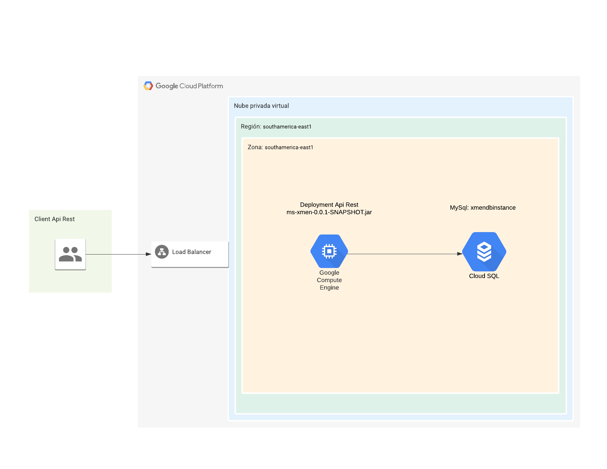
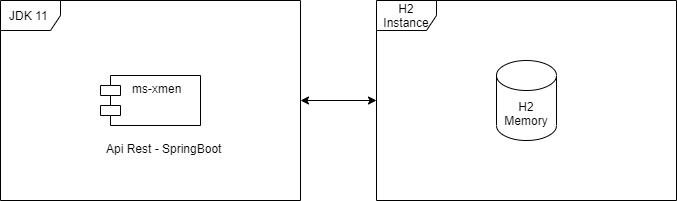
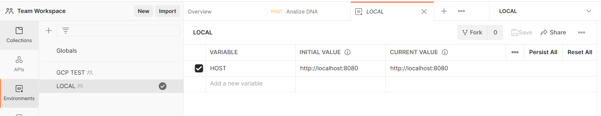
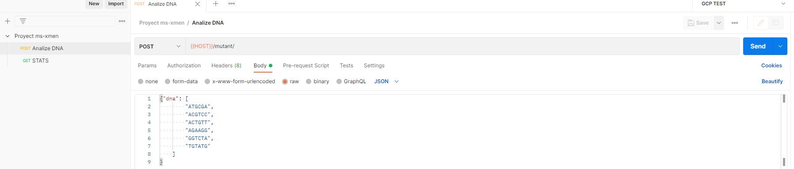
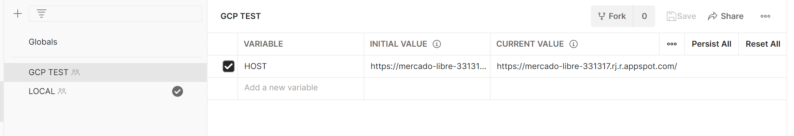
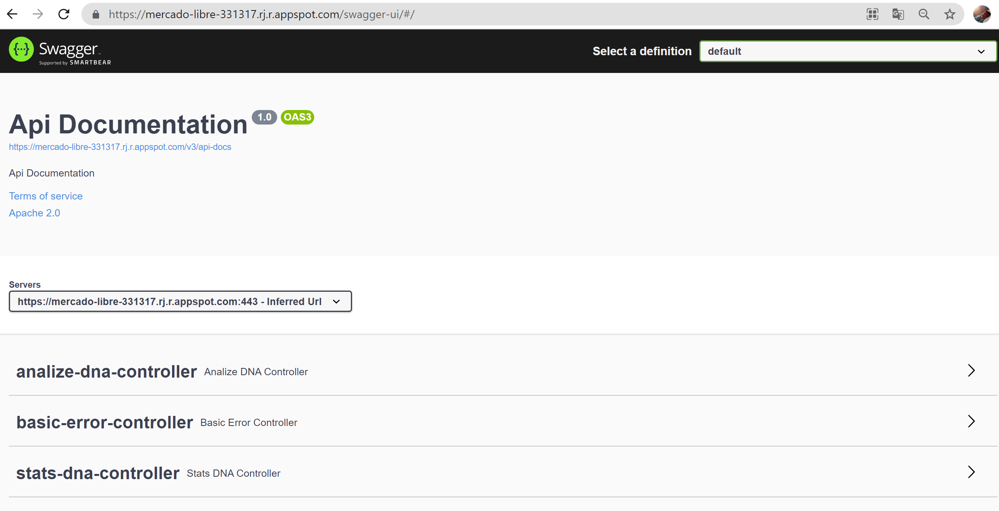
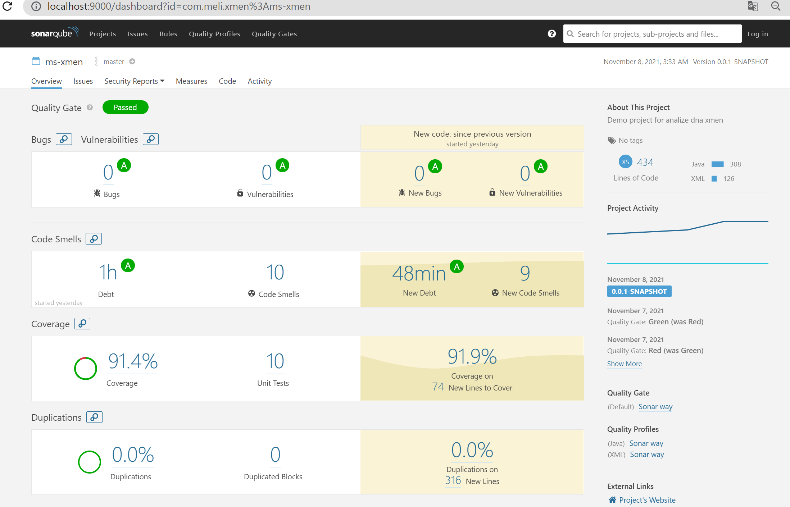
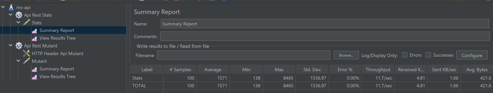
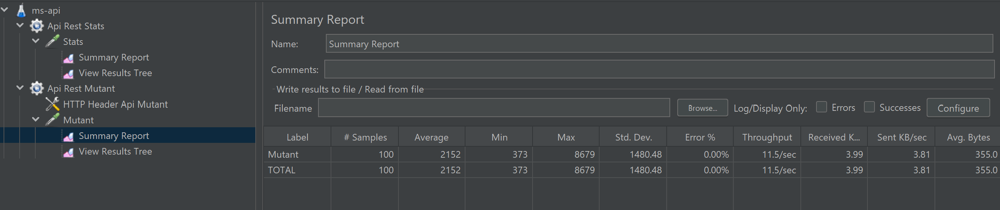

# Technical Exam ms-xmen
Rest api that analyzes the DNA and is able to recognize if it is human or mutant and persists in a database the queries

## Diagram ms-xmen Google Cloud Platform 


## Diagram ms-xmen Local



## Required Setup Local
* Java 11 https://jdk.java.net/11/
* docker https://hub.docker.com/
* mvn https://maven.apache.org/download.cgi
* JMeter for test stress https://jmeter.apache.org/download_jmeter.cgi
* Postman for execute apis https://www.postman.com/downloads/
* 
##  How to deploy Project ms-xmen  locally
* Execute command ```mvn spring-boot:run``` in the root folder ms-xmen
* Import ms-xmen\postman\Proyect ms-xmen.postman_collection.json
* Create Global Environment Local--> http://localhost:8080
 

* Select Environment LOCAL and Execute the Send button in the upper right corner



##  How to deploy Project ms-xmen GOOGLE CLOUD 
* Create Global Environment GCP Test--> https://mercado-libre-331317.rj.r.appspot.com/
  
Execute command ```mvn -DskipTests package appengine:deploy```, To deploy in google cloud, it is necessary to be a collaborator of the project, please contact ips.nuevo@gmail.com to be added

##  Another way to consume the service by Swagger
* Local  --> http://localhost:8080/swagger-ui/#/
* GCP    --> https://mercado-libre-331317.rj.r.appspot.com/swagger-ui/#/



## Required Analize Sonar
* Execute command ```mvn clean package``` 
* Execute command docker ```docker run -d --name sonarqube -p 9000:9000 sonarqube:7.5-community```
* verify docker up with command ```docker ps``` verify that it is up ```75264b55f36e   sonarqube:7.5-community   "./bin/run.sh"           14 minutes ago   Up 14 minutes   0.0.0.0:9000->9000/tcp   sonarqube```
* Wait for the server to start and log in to SonarQube server on http://localhost:9000 using default credentials: login: admin password: admin
* Go to: http://localhost:9000/account/security/ and generate a token.
* To analyze the project run the command ```mvn sonar:sonar -Dsonar.host.url=http://localhost:9000   -Dsonar.login=REPLACE_ID_GENERATED```

## Sonar Evidence


## Required Analize JMeter Test Stress
* Import ms-api.jmx file located in the path ms-xmen\jmeter and play button Start


## JMeter Test Stress Evidence
* Shows 100 requests all successful, for api https://mercado-libre-331317.rj.r.appspot.com/stats/

* Shows 100 requests all successful, for api https://mercado-libre-331317.rj.r.appspot.com/mutant/



## Examen Mercadolibre
Magneto quiere reclutar la mayor cantidad de mutantes para poder luchar
contra los X-Men.

Te ha contratado a ti para que desarrolles un proyecto que detecte si un
humano es mutante basándose en su secuencia de ADN.

Para eso te ha pedido crear un programa con un método o función con la siguiente firma (En
alguno de los siguiente lenguajes: Java / Golang / C-C++ / Javascript (node) / Python / Ruby):
* boolean isMutant(String[] dna); // Ejemplo Java

En donde recibirás como parámetro un array de Strings que representan cada fila de una tabla
de (NxN) con la secuencia del ADN. Las letras de los Strings solo pueden ser: (A,T,C,G), las
cuales representa cada base nitrogenada del ADN.

### No-Mutante
A T G C G A

C A G T G C

T T A T T T

A G A C G G

G C G T C A

T C A C T G


### Mutante
A T G C G A

C A G T G C

T T A T G T

A G A A G G

C C C C T A

T C A C T G


Sabrás si un humano es mutante, si encuentras más de una secuencia de cuatro letras
iguales​, de forma oblicua, horizontal o vertical.
Ejemplo (Caso mutante):

String[] dna = {"ATGCGA","CAGTGC","TTATGT","AGAAGG","CCCCTA","TCACTG"};


En este caso el llamado a la función isMutant(dna) devuelve “true”.
Desarrolla el algoritmo de la manera más eficiente posible.
Desafíos:


## Nivel 1:
Programa (en cualquier lenguaje de programación) que cumpla con el método pedido por
Magneto.

## Nivel 2:
Crear una API REST, hostear esa API en un cloud computing libre (Google App Engine,
Amazon AWS, etc), crear el servicio “/mutant/” en donde se pueda detectar si un humano es
mutante enviando la secuencia de ADN mediante un HTTP POST con un Json el cual tenga el
siguiente formato:

POST → /mutant/
{
“dna”:["ATGCGA","CAGTGC","TTATGT","AGAAGG","CCCCTA","TCACTG"]
}

En caso de verificar un mutante, debería devolver un HTTP 200-OK, en caso contrario un
403-Forbidden

## Nivel 3:
Anexar una base de datos, la cual guarde los ADN’s verificados con la API.
Solo 1 registro por ADN.

Exponer un servicio extra “/stats” que devuelva un Json con las estadísticas de las
verificaciones de ADN: {"count_mutant_dna" : 40, "count_human_dna" : 100, "ratio" : 0.4 }
Tener en cuenta que la API puede recibir fluctuaciones agresivas de tráfico (Entre 100 y 1
millón de peticiones por segundo).
Test-Automáticos, Code coverage > 80%.


