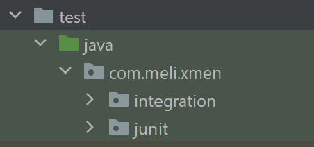
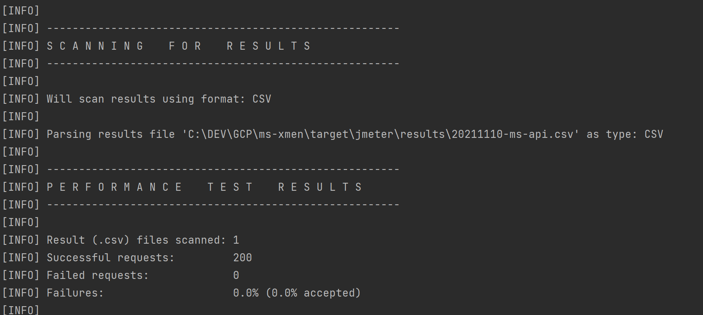

# Technical Exam ms-xmen
Rest api that analyzes the DNA and is able to recognize if it is human or mutant and persists in a database the queries

## Diagram ms-xmen Google Cloud Platform 


## Diagram ms-xmen Local


## Required Setup Local
* Java 11 https://jdk.java.net/11/
* docker https://hub.docker.com/
* mvn https://maven.apache.org/download.cgi
* JMeter for test stress https://jmeter.apache.org/download_jmeter.cgi
* Postman for execute apis https://www.postman.com/downloads/
* 
##  How to deploy Project ms-xmen  locally
* Execute command ```mvn spring-boot:run``` in the root folder ms-xmen
* Import ms-xmen\postman\Proyect ms-xmen.postman_collection.json
* Create Global Environment Local--> http://localhost:8080
 

* Select Environment LOCAL and Execute the Send button in the upper right corner


##  How to deploy Project ms-xmen GOOGLE CLOUD 
* Create Global Environment GCP Test--> https://mercado-libre-331317.rj.r.appspot.com/
  
Execute command ```mvn -DskipTests package appengine:deploy```, To deploy in google cloud, it is necessary to be a collaborator of the project, please contact ips.nuevo@gmail.com to be added

##  Another way to consume the service by Swagger
* Local  --> http://localhost:8080/swagger-ui/#/
* GCP    --> https://mercado-libre-331317.rj.r.appspot.com/swagger-ui/#/


## Required Analize Sonar
* Execute command ```mvn clean package``` 
* Execute command docker ```docker run -d --name sonarqube -p 9000:9000 sonarqube:7.5-community```
* verify docker up with command ```docker ps``` verify that it is up ```75264b55f36e   sonarqube:7.5-community   "./bin/run.sh"           14 minutes ago   Up 14 minutes   0.0.0.0:9000->9000/tcp   sonarqube```
* Wait for the server to start and log in to SonarQube server on http://localhost:9000 using default credentials: login: admin password: admin
* Go to: http://localhost:9000/account/security/ and generate a token.
* To analyze the project run the command ```mvn sonar:sonar -Dsonar.host.url=http://localhost:9000   -Dsonar.login=REPLACE_ID_GENERATED```

## Sonar Evidence


## Test
* The test folder contains 2 types, the unit tests, and the integration test, which performs an end-to-end test, execute command ```mvn test```


## Required Analize JMeter Test Stress
* Import ms-api.jmx file located in the path ms-xmen\src\test\jmeter\ms-api.jmx and play button Start

## Another way to execute command 
* Execute command ```mvn clean verify```, this command will execute the performance tests previously configured in the ms-api.jmx file



## JMeter Test Stress Evidence
* Shows 100 requests all successful, for api https://mercado-libre-331317.rj.r.appspot.com/stats/

* Shows 100 requests all successful, for api https://mercado-libre-331317.rj.r.appspot.com/mutant/


  

